# CareSync User Guide

CareSync is a desktop application designed for **Social Workers in Singapore** to manage client and support organization contact details, as well as track home visit schedules efficiently.

CareSync is **optimized for use via a Line Interface** (CLI) while still having the benefits of a Graphical User Interface (GUI). If you can type fast, CareSync can get your contact management tasks done faster than traditional GUI applications.

## Table of contents
- [CareSync User Guide](#caresync-user-guide)
  - [Table of contents](#table-of-contents)
  - [Quick start](#quick-start)
    - [Step 1 - Java Installation](#step-1---java-installation)
    - [Step 2 - Download and Run CareSync](#step-2---download-and-run-caresync)
    - [Step 3 - Get Started!](#step-3---get-started)
  - [Features](#features)
    - [Viewing help : `help`](#viewing-help--help)
    - [Adding a contact: `add`](#adding-a-contact-add)
    - [Archiving a contact : `archive`](#archiving-a-contact--archive)
    - [Listing all unarchived contacts : `list`](#listing-all-unarchived-contacts--list)
    - [Listing all archived contacts : `list-archive`](#listing-all-archived-contacts--list-archive)
    - [Editing a contact : `edit`](#editing-a-contact--edit)
    - [Locating contacts by specified field: `find`](#locating-contacts-by-specified-field-find)
    - [Adding note to a contact : `note`](#adding-note-to-a-contact--note)
    - [Managing tags for a contact : `tag`](#managing-tags-for-a-contact--tag)
    - [Deleting contact(s) : `delete`](#deleting-contacts--delete)
    - [Unarchiving a contact : `unarchive`](#unarchiving-a-contact--unarchive)
    - [Clearing all entries : `clear`](#clearing-all-entries--clear)
    - [Exiting the program : `exit`](#exiting-the-program--exit)
    - [Autocompleting a command](#autocompleting-a-command)
    - [Remembering a command](#remembering-a-command)
    - [Saving the data](#saving-the-data)
    - [Editing the data file](#editing-the-data-file)
  - [FAQ](#faq)
  - [Known issues](#known-issues)
  - [Command summary](#command-summary)
  - [Glossary](#glossary)

<!-- * Table of Contents -->
<page-nav-print />

--------------------------------------------------------------------------------------------------------------------

## Quick start

### Step 1 - Java Installation
- Ensure that you have Java `17` or above installed on your computer. Installation guides can be found [here](https://se-education.org/guides/tutorials/javaInstallation.html).

<box type="important" seamless>

**Important:** Follow the guide for your operating system!
</box>

- To check for the Java version installed on your computer, open a command terminal and enter `java --version`. Example output for Java `17`:
```
java version "17.0.17" 2025-10-21 LTS
Java(TM) SE Runtime Environment (build 17.0.17+8-LTS-360)
Java HotSpot(TM) 64-Bit Server VM (build 17.0.17+8-LTS-360, mixed mode, sharing)
```

### Step 2 - Download and Run CareSync

1. Download the latest `CareSync.jar` file from [here](https://github.com/AY2526S2-CS2103-F11-1/tp/releases).

2. Copy the file to the folder you want to use as the _home folder_ for CareSync.

3. Open a command terminal and navigate (`cd`) to the folder you placed `CareSync.jar` .

4. In the command terminal, enter `java -jar CareSync.jar` to run the application.<br>
   A GUI similar to the below should appear in a few seconds. There will be some sample data in the application to get you started!.<br>
   

### Step 3 - Get Started!

- Type a command in the command box and press Enter to execute it (e.g. typing **`help`** and pressing Enter will open the help window).<br>
- Some example commands you can try:
   * `list` : Lists all contacts.

   * `add n/John Doe p/98765432 e/johnd@example.com a/John street, block 123, #01-01 nt/Needs financial support v/2026-12-01 14:00` : Adds a contact named `John Doe` to CareSync with the specified `note` and `visit date and time`.

   * `delete 3` : Deletes the 3rd contact shown in the current list.

   * `find t/caseid1` : Lists all contacts with the `caseid1` tag.

   * `exit` : Exits the app.

- For details of each command, refer to the [Features](#features) section below.

--------------------------------------------------------------------------------------------------------------------

## Features

<box type="info" seamless>

**Notes about the command format:**<br>

* **New users** do check out the Glossary [here](#glossary) first!

* Words in `UPPER_CASE` are the parameters to be supplied by the user.<br>
  e.g. in `add n/NAME`, `NAME` is a parameter which can be used as `add n/John Doe`.

* Items in square brackets are optional.<br>
  e.g `n/NAME [t/TAG]` can be used as `n/John Doe t/client` or as `n/John Doe`.

* Items with `…`​ after them can be used multiple times including zero times.<br>
  e.g. `[t/TAG]…​` can be used as ` ` (i.e. 0 times), `t/client`, `t/client t/caseid1` etc.

* Parameters can be in any order.<br>
  e.g. if the command specifies `n/NAME p/PHONE_NUMBER`, `p/PHONE_NUMBER n/NAME` is also acceptable.

* Extraneous parameters for commands that do not take in parameters (such as `help`, `list-archive`, `exit` and `clear`) will be ignored.<br>
  e.g. if the command specifies `help 123`, it will be interpreted as `help`.

* If you are using a PDF version of this document, be careful when copying and pasting commands that span multiple lines as space characters surrounding line-breaks may be omitted when copied over to the application.
</box>

### Viewing help : `help`

Opens the Help window.

<box type="info" seamless>

**Info:** If the Help window is already open, the command will bring it into focus instead of opening a new window.
</box>

Format: `help`

Examples:
* `help`

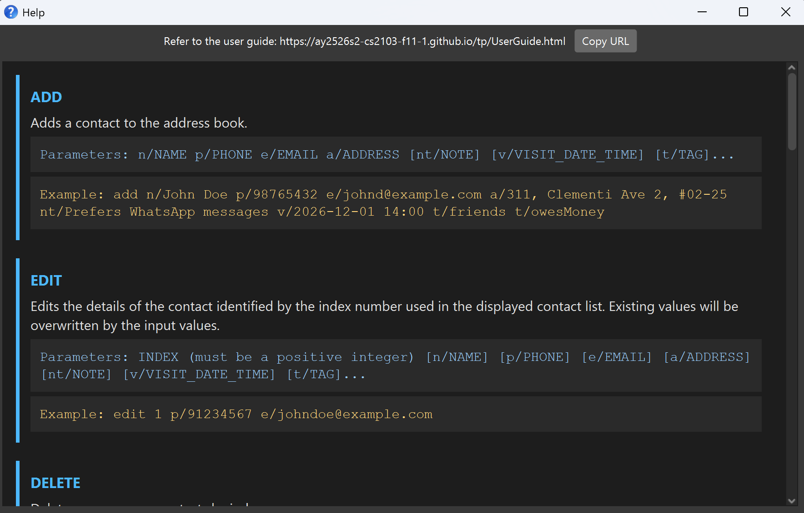

### Adding a contact: `add`

Adds a contact to CareSync.

Format: `add n/NAME p/PHONE_NUMBER e/EMAIL a/ADDRESS [nt/NOTE] [v/VISIT_DATE_TIME] [t/TAG]…​`

* `n/`, `p/`, `e/`, and `a/` are **compulsory** and must each appear **exactly once**.
* `nt/` and `v/` are **optional** and can each appear at most once.
* You cannot add a contact whose name already exists in CareSync.

<box type="tip" seamless>

**Tip:** A contact can have any number of tags (including 0)
</box>

Examples:
* `add n/Betsy Crowe p/61234567 e/betsycrowe@example.com a/Newgate Road #02-01`
* `add n/John Doe p/98765432 e/johnd@example.com a/John street, block 123, #01-01 nt/Needs financial support v/2026-12-01 14:00`

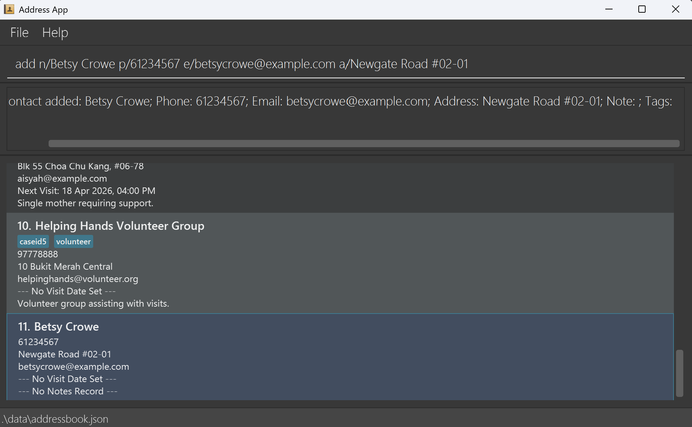

### Archiving a contact : `archive`
Archives a contact identified by the index number shown in the current list.

Format: `archive INDEX`

* Archives the contact at the specified INDEX.
* CareSync will prevent duplicate archiving by displaying an alert if the selected contact is already archived.
* After a successful archive, the displayed list refreshes to update the currently shown list.

Examples:
* `archive 1`
* `find n/Alex` followed by `archive 1` archives the 1st contact in the find results.

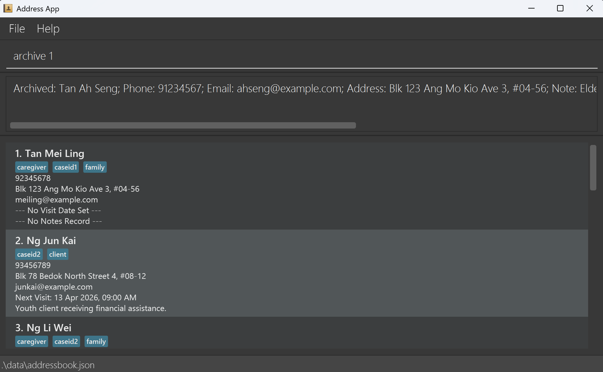

### Listing all unarchived contacts : `list`

Shows a list of all **unarchived** contacts in CareSync.  
Optionally, the list can be **sorted by a specified field**.

Format: `list [s/FIELD]`

* If no sorting field is provided, all contacts are listed in their default order (i.e. the original stored order of contacts).
* If a sorting field is provided, the list will be sorted according to the specified field.
* Valid fields:
  * `name` - sorts contacts alphabetically by name
  * `visit` - sorts contacts by visit date and time

<box type="info" header="Note:" seamless>

* `FIELD` is case-insensitive. e.g., `NAME`, `VISIT` are also allowed
* When sorting by `visit`:
    * Contacts **with visit date and time** are shown first (sorted chronologically).
    * Contacts **without visit date and time** will appear **below** and **sorted by name**.
</box>

<box type="warning">

**Sorting is persistent.** Once a sort is applied, it will be sorted by that specified field until a new `list` command is entered.
</box>

Examples:
* `list`
* `list s/name`
* `list s/visit`

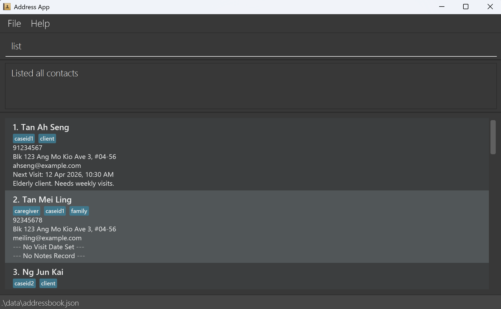

### Listing all archived contacts : `list-archive`

Shows a list of all **archived** contacts in CareSync.

Format: `list-archive`

* This command does not take any parameters.
* The displayed list is updated to show archived contacts only.
* If there are no archived contacts, an empty list is shown.

Examples:
* `list-archive`

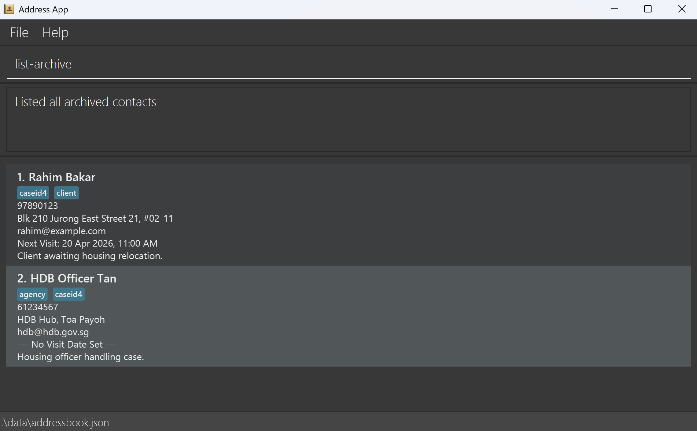

### Editing a contact : `edit`

Edits an existing contact in CareSync.

Format: `edit INDEX [n/NAME] [p/PHONE] [e/EMAIL] [a/ADDRESS] [nt/NOTE] [v/VISIT_DATE_TIME] [t/TAG]…​`

* Edits the contact at the specified `INDEX`.
* **At least one of the optional fields** must be provided.
* Existing values will be updated to the input values.
* When editing tags, the **existing tags of the contact will be removed** i.e adding of tags is not cumulative.
* You can remove all the contact's tags by typing `t/` without
    specifying any tags after it.

Examples:
*  `edit 1 p/91234567 e/johndoe@example.com` Edits the phone number and email address of the 1st contact to be `91234567` and `johndoe@example.com` respectively.
*  `edit 2 n/Betsy Crower t/` Edits the name of the 2nd contact to be `Betsy Crower` and clears all existing tags.

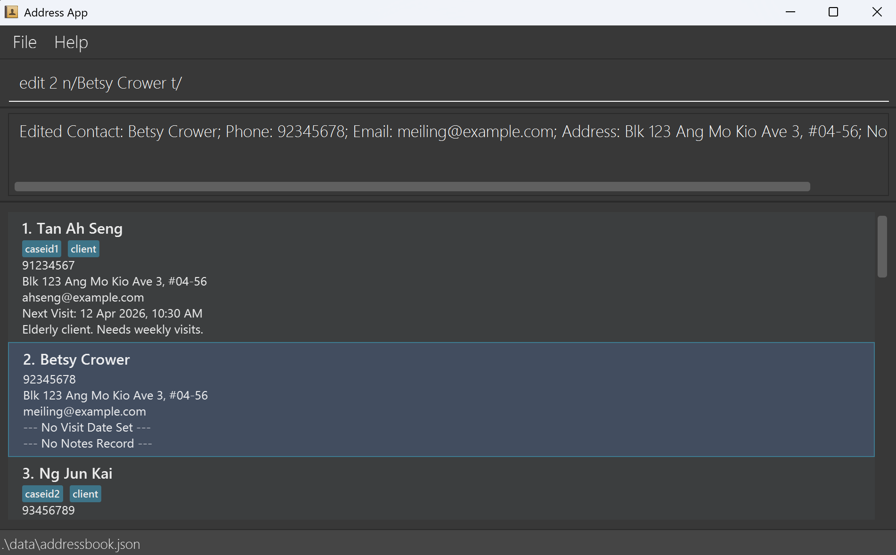

### Locating contacts by specified field: `find`

Finds **unarchived** contacts whose information matches the provided search criteria.

<box type="important" seamless>

The `find` command enforces a **Strict Single-Mode policy** - only one search mode can be used per command.
</box>

Format:
- By name: `find n/KEYWORD [MORE_KEYWORDS]…`
- By tag: `find t/TAG`
- By specific date: `find d/DATE`
- By today: `find d/today`
- By date range: `find sd/START_DATE ed/END_DATE`

<box type="tip" seamless>

**Tip:** `d/`, `sd/` and `ed/` can all use the `today` keyword to specify today's date!
</box>

<box type="info" seamless>

**Name search rules:**
* Name search is case-insensitive. e.g., `hans` will match `Hans`
* Name search finds names that **starts with** the provided name keyword.
* Multiple name keywords are treated separately.
  * `find n/Ale Ber` will match `Alex` and `Bernice`

**Tag search rules:**
* Tag search is case-insensitive. e.g., `FAMILY` will match `family`
* Tag search finds tags that **starts with** the provided tag keyword.
* Only **one tag** can be searched at a time.

**Date search rules:**
* For date ranges, both `sd/` (start date) and `ed/` (end date) prefixes are required.
  * `ed/`can be specified first before `sd/`. i.e, `find ed/END_DATE sd/START_DATE` is also valid.
* Date specified in `ed/` (end date) must be later than or equal to date specified in `sd/` (start date).
</box>

Examples:
* `find n/John` returns `john` and `John Doe`
* `find t/caseid1` returns all contacts with the `caseid1` tag (case-insensitive).
* `find d/today` returns all contacts with visits scheduled for today.
* `find sd/2026-01-01 ed/2026-04-30` returns all contacts with visits between 1 January 2026 and 30 April 2026 (inclusive).

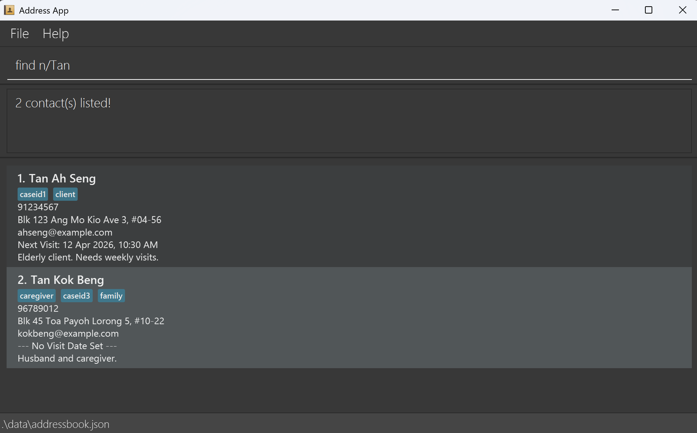

### Adding note to a contact : `note`

Adds, replaces, or clears a note for the specified contact.

Format: `note INDEX nt/NOTE`

* Adds or replaces the note for the contact at the specified `INDEX`.

<box type="tip" seamless>

**Tip:** To clear a note, provide an empty `nt/` prefix (e.g., `nt/` with no text after it)
</box>

Examples:
* `note 1 nt/Requires wheelchair assistance` adds or replaces the note for the 1st contact in the list.
* `note 1 nt/` clears the note for the 1st contact in the list.

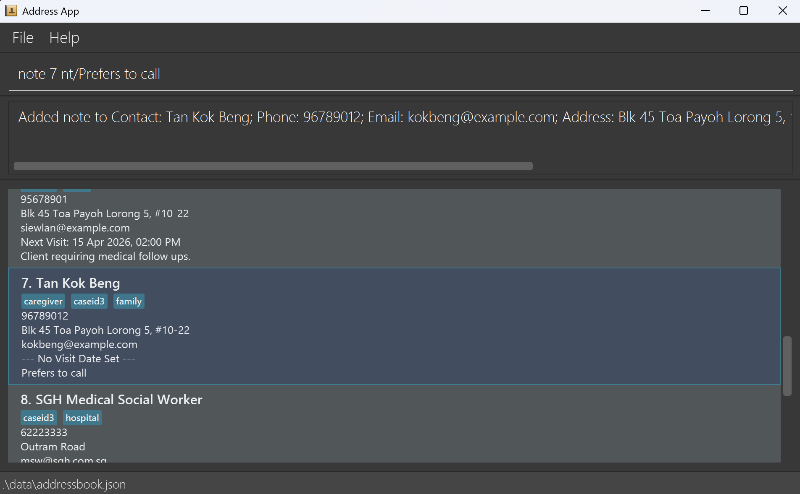

### Managing tags for a contact : `tag`

Adds or removes specific tags for the specified contact. Unlike `edit`, this command modifies tags incrementally without clearing existing tags.

Format: `tag INDEX [at/TAG_TO_ADD]… [dt/TAG_TO_DELETE]…`

* Operates on the contact at the specified `INDEX`.
* Use `at/` prefix to add one or more tags. 
* Use `dt/` prefix to delete one or more tags.
* Both `at/` and `dt/` can be used together in a single command to add and delete tags simultaneously.

<box type="warning" seamless>

**Error Handling:**
* Adding a tag that already exists on the contact will be rejected.
* Deleting a tag that does not exist on the contact will be rejected.
* If any part of the command fails validation, **no changes will be applied**.
</box>

Examples:
* `tag 1 at/caseid2` adds the tag `caseid2` to the 1st contact.
* `tag 1 dt/client` removes the tag `client` from the 1st contact.
* `tag 1 at/client at/caseid2` adds the tags `client` `caseid2` to the 1st contact.
* `tag 1 dt/client dt/caseid2` removes the tags `client` `caseid2` from the 1st contact.
* `tag 1 at/client dt/caseid1` adds `client` and removes `caseid1` from the 1st contact.

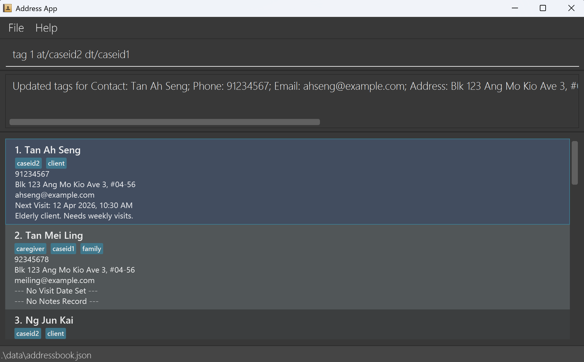

### Deleting contact(s) : `delete`

Deletes one or more contacts from CareSync.

Format: `delete INDEX [MORE INDEXES or RANGES]…`

* Deletes the contact(s) at the specified index(es) and range(s).
* A range is specified the format `START_INDEX-END_INDEX`, using `-`.
  * `END_INDEX` must be greater than or equal to `START_INDEX` (e.g. delete 3-1 is invalid).
  * The maximum range cannot exceed 100.
* Indexes do **not need to be in ascending order** (e.g. `delete 5 2 4` is valid).
* Duplicate indexes will be automatically ignored.
* Extra whitespaces (` `) will be automatically ignored.

<box type="warning" seamless>

**Error Handling:**
* If any specified index does not exist, the command will fail and display the invalid index(es).
* All indexes are validated before deletion. If any index is invalid, **no deletion will occur**.
</box>

Examples:
* `list` followed by `delete 2` deletes the 2nd contact in CareSync.
* `find Betsy` followed by `delete 1` deletes the 1st contact in the results of the `find` command.

<box type="tip" seamless>

**Tip:** Use multiple index and/or ranges for bulk deletion
</box>

* `delete 1 3 5` deletes the 1st, 3rd, 5th contact in CareSync.
* `delete 2-4` deletes the 2nd, 3rd, 4th contact in CareSync.
* `delete 1 3-5 8` deletes 1st, 3rd, 4th, 5th, 8th contact in CareSync.

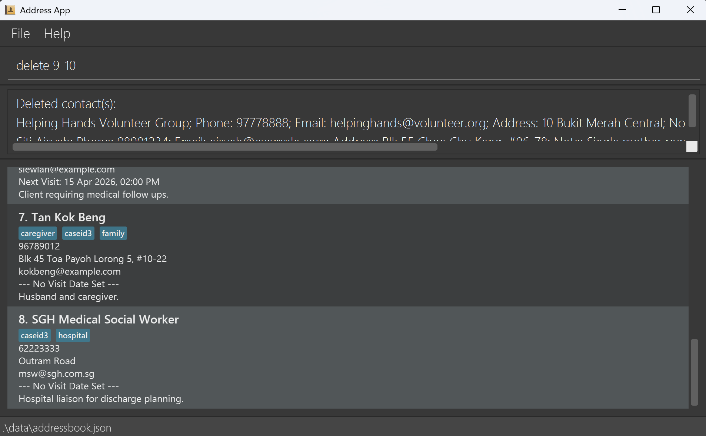

### Unarchiving a contact : `unarchive`
Unarchives a contact identified by the index number shown in the current list.

<box type="tip" seamless>

**Tip:** Run `list-archive` first, then `unarchive INDEX`.
</box>

Format: `unarchive INDEX`

* Unarchives the contact at the specified INDEX.
* If the selected contact is not archived, CareSync will show a message indicating that the contact is not archived.
* After a successful unarchive, the displayed list refreshes to update the currently shown list. 

<box type="tip" seamless>

**Tip:** To return to the original list, run `list`.
</box>

Examples:
* `list-archive` followed by `unarchive 1` unarchives the 1st contact in the archived list.
* `unarchive 2`

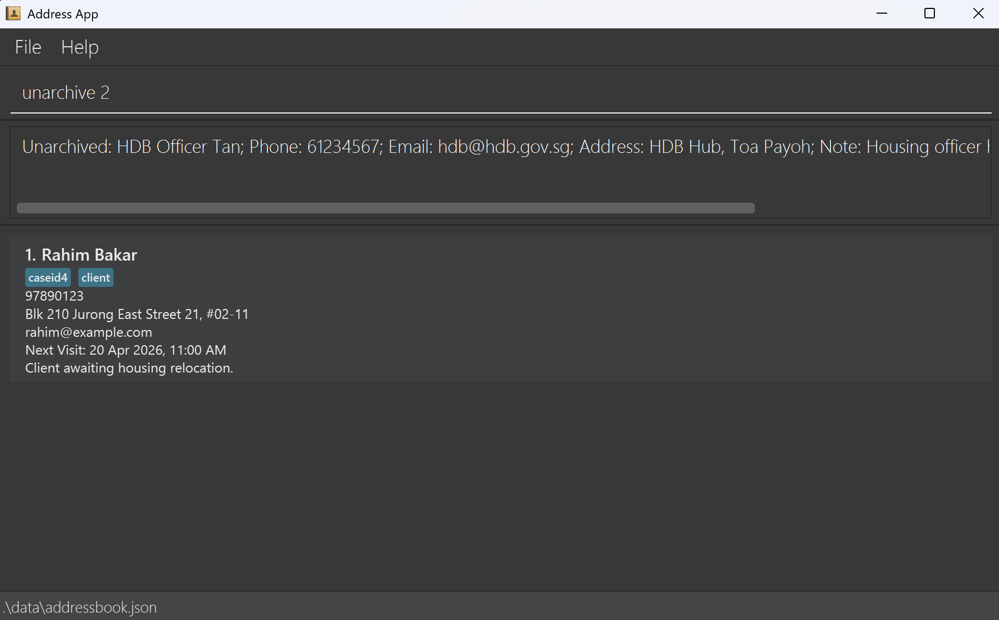

### Clearing all entries : `clear`

Clears all entries in CareSync.

<box type="warning">

**Warning: This is IRREVERSIBLE!**
</box>

Format: `clear`

### Exiting the program : `exit`

Exits CareSync.

Format: `exit`

### Autocompleting a command

Autocompletes a command or its prefixes with `TAB`

* Command
  * Suggests the shortest command that starts with the user input.
    * `li` suggests `list`
    * `list` suggests `list-archive`
* Prefix
  * Suggests next valid prefix.
    * `edit 1 n/Alex` suggests `edit 1 n/Alex p/`
    * `find n/Alex` will not suggest a second prefix.

Examples:
* After typing `d`, CareSync will suggest `delete`.
* After typing `add`, CareSync will suggest `n/`.

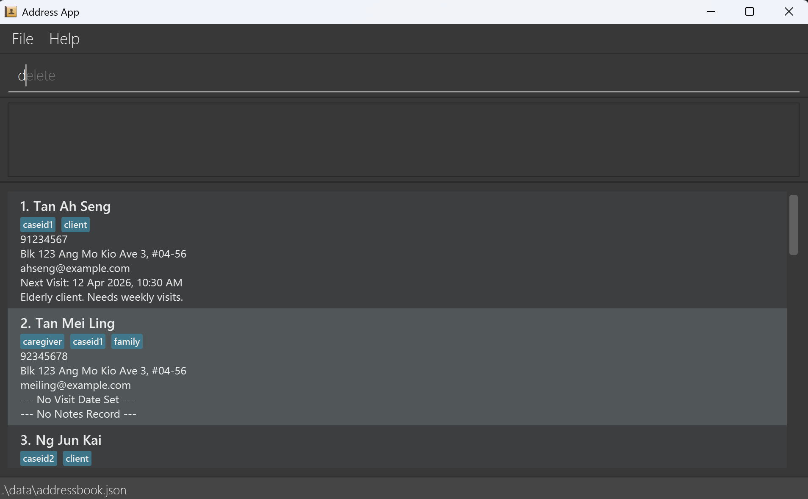

### Remembering a command

Cycle through entered commands with `↑` / `↓` arrow keys in the command box.
* `↑` cycles back into history and `↓` cycles forward to the most recent command entered.
* Consecutive identical commands are collapsed into one entry in history.
  * Entering `list` followed by `list`, the command history will only save one instance of `list`.

<box type="tip" seamless>

**Invalid commands** entered will still be saved in history.
</box>

### Saving the data

CareSync data is saved in the hard disk automatically after any command that changes the data. There is no need to save manually.

Running CareSync for the first time without any existing data folder will generate a JSON file.

### Editing the data file

CareSync data is saved automatically as a JSON file `[JAR file location]/data/addressbook.json`. Advanced users are welcome to update data directly by editing that data file.

<box type="warning" seamless>

**Caution:**
If your changes to the data file makes its format invalid, CareSync will discard all data and start with an empty data file at the next run.  Hence, it is recommended to take a backup of the file before editing it.<br>
Furthermore, certain edits can cause the CareSync to behave in unexpected ways (e.g., if a value entered is outside the acceptable range). Therefore, edit the data file only if you are confident that you can update it correctly.
</box>

--------------------------------------------------------------------------------------------------------------------

## FAQ

**Q**: How do I transfer my data to another Computer?<br>
**A**: Install the app in the other computer and overwrite the empty data file it creates with the file that contains the data of your previous CareSync home folder.

--------------------------------------------------------------------------------------------------------------------

## Known issues

1. **When using multiple screens**, if you move the application to a secondary screen, and later switch to using only the primary screen, the GUI will open off-screen. The remedy is to delete the `preferences.json` file created by the application before running the application again.
2. **If you minimize the Help Window** and then run the `help` command (or use the `Help` menu, or the keyboard shortcut `F1`) again, the original Help Window will remain minimized, and no new Help Window will appear. The remedy is to manually restore the minimized Help Window.

--------------------------------------------------------------------------------------------------------------------

## Command summary

Action     | Format                                                                    | Examples
-----------|---------------------------------------------------------------------------|------------------------------------------------------------------------------------------
**Help**   | `help` | `help`
**Add**    | `add n/NAME p/PHONE_NUMBER e/EMAIL a/ADDRESS [nt/NOTE] [v/VISIT_DATE_TIME] [t/TAG]…​` <br> | `add n/John Doe p/98765432 e/johnd@example.com a/John street, block 123, #01-01 nt/Needs financial support v/2026-12-01 14:00`
**Archive**| `archive INDEX`<br> | `archive 1`
**List**   | `list [s/FIELD]`<br> | `list`<br>`list s/name`<br>`list s/visit`
**List Archive** | `list-archive` | `list-archive`
**Edit**   | `edit INDEX [n/NAME] [p/PHONE_NUMBER] [e/EMAIL] [a/ADDRESS] [nt/NOTE] [v/VISIT_DATE_TIME] [t/TAG]…​`<br> | `edit 1 p/91234567 e/johndoe@example.com`<br> `edit 2 nt/ t/` *(clears note and tag)*
**Find**   | `find n/KEYWORD [MORE_KEYWORDS]…`<br>`find t/TAG`<br>`find d/DATE`<br>`find sd/START_DATE ed/END_DATE`<br> | `find n/James Jake`<br>`find t/caseid1`<br>`find d/today`<br>`find sd/2026-01-01 ed/2026-04-30`<br>
**Note**   | `note INDEX nt/NOTE`<br> | `note 1 nt/Requires wheelchair assistance`<br>`note 2 nt/` *(clears note)*
**Tag**    | `tag INDEX [at/TAG_TO_ADD]…​ [dt/TAG_TO_DELETE]…​`<br> | `tag 1 at/client dt/caseid1`
**Delete** | `delete INDEX [MORE INDEXES or RANGES]…`<br> | `delete 1 3 6-9`
**Unarchive** | `unarchive INDEX`<br> | `unarchive 1`
**Clear**  | `clear` | `clear`
**Exit**   | `exit` | `exit`


## Glossary

<box type="info" seamless>

**Alphanumeric characters** include all lower and upper case letters and numbers only!
</box>

- **INDEX**: Refers to the index number shown in the displayed contact list.
  - **Must be a positive integer** 1, 2, 3, …
  - Must be a valid integer in the **range of the displayed contact list**<br><br>
- **n/NAME**: Refers to the name of the contact.
  - The 1st character **must be an alphanumeric character**
  - Can only contain alphanumeric characters and whitespaces (` `)
  - Max length: 80<br><br>
- **p/PHONE_NUMBER**: Refers to the phone number of the contact.
  - Can only contain numeric characters, whitespaces (` `) and certain special characters (`+-`)
  - Must contain at least one numeric character.
  - Max length: 15<br><br>
- **e/EMAIL**: Refers to the email address of the contact.
  - `local@domain` pattern
  - Max length: 254<br><br>
- **a/ADDRESS**: Refers to the address of the contact.
  - Can only contain alphanumeric characters, whitespaces (` `) and certain special characters (`,.#'()-`)
  - Must contain at least one non-whitespace character.
  - Max length: 120<br><br>
- **nt/NOTE**: Refers to the note of the contact.
  - The 1st character **must be a valid non whitespace (` `) character**
  - Can only contain alphanumeric characters, whitespaces (` `) and certain special characters (`,.`)
  - Max length: 150<br><br>
- **v/VISIT_DATE_TIME**: Refers to the visit date and time of the contact.
  - Must be in `yyyy-MM-dd HH:mm` format
  - Any month not in the range of `01` to `12` (inclusive) is treated as invalid
  - Any day not in the range of `01` to `31` (inclusive) is treated as invalid
  - Any hour not in the range of `00` to `23` (inclusive) is treated as invalid
  - Any minute not in the range of `00` to `59` (inclusive) is treated as invalid
  - Exceptions:
    - `24:00` is treated as `00:00` of the next day
    - For any month that has a max date smaller than `31`, inputting an invalid date smaller than `31` (inclusive) will be rounded to the highest valid date<br><br>
- **d/DATE, sd/DATE, ed/DATE**: Refers to the visit date of the contact.
  - Must be in `yyyy-MM-dd` format or use the `today` keyword to specify today's date
  - For any month that has a max date smaller than `31`, inputting an invalid date smaller than `31` (inclusive) will be rounded to the highest valid date<br><br>
- **t/TAG, at/TAG_TO_ADD, dt/TAG_TO_DELETE**: Refers to the tag of the contact.
  - Can only contain alphanumeric characters
  - Can only be in lowercase (i.e. `CASEID1` is the same as `caseid1`)
  - Max length: 15
