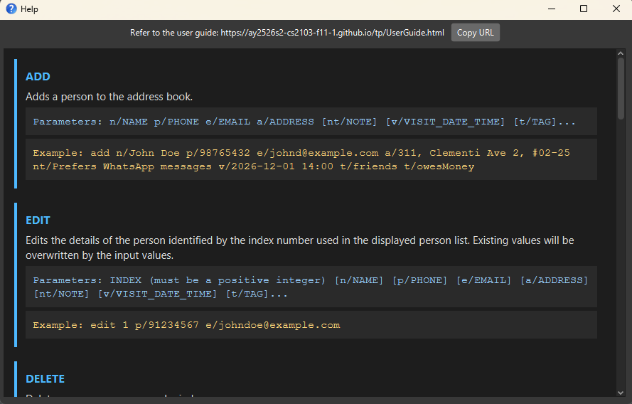

# CareSync User Guide

CareSync is a desktop application designed for **Social Workers in Singapore** to manage client and support organization contact details, as well as track home visit schedules efficiently.

CareSync is **optimized for use via a Line Interface** (CLI) while still having the benefits of a Graphical User Interface (GUI). If you can type fast, CareSync can get your contact management tasks done faster than traditional GUI applications.

## Table of contents
- [Quick start](#quick-start)
- [Features](#features)

<!-- * Table of Contents -->
<page-nav-print />

--------------------------------------------------------------------------------------------------------------------

## Quick start

### Step 1 - Java Installation
- Ensure that you have Java `17` or above installed on your computer. Installation guides can be found [here](https://se-education.org/guides/tutorials/javaInstallation.html).

<box type="important">
Follow the guide for your operating system!
</box>

- To check for the Java version installed on your computer, open a command terminal and enter `java --version`. Example output for Java `17`:
```
java version "17.0.17" 2025-10-21 LTS
Java(TM) SE Runtime Environment (build 17.0.17+8-LTS-360)
Java HotSpot(TM) 64-Bit Server VM (build 17.0.17+8-LTS-360, mixed mode, sharing)
```

### Step 2 - Download and Run CareSync

1. Download the latest `CareSync.jar` file from [here](https://github.com/AY2526S2-CS2103-F11-1/tp/releases).

2. Copy the file to the folder you want to use as the _home folder_ for CareSync.

3. Open a command terminal and navigate (`cd`) to the folder you placed `CareSync.jar` .

4. In the command terminal, enter `java -jar CareSync.jar` to run the application.<br>
   A GUI similar to the below should appear in a few seconds. There will be some sample data in the application to get you started!.<br>
   

### Step 3 - Get Started!

- Type a command in the command box and press Enter to execute it. e.g. typing **`help`** and pressing Enter will open the help window.<br>
   Some example commands you can try:

   * `list` : Lists all contacts.

   * `add n/John Doe p/98765432 e/johnd@example.com a/John street, block 123, #01-01 nt/Needs financial support v/2026-12-01 14:00` : Adds a contact named `John Doe` to CareSync with the specified `note` and `visit date and time`.

   * `delete 3` : Deletes the 3rd contact shown in the current list.

   * `find t/caseid1` : Lists all contacts with the `caseid1` tag.

   * `exit` : Exits the app.

- For details of each command, refer to the [Features](#features) section below.

--------------------------------------------------------------------------------------------------------------------

## Features

<box type="info" seamless>

**Notes about the command format:**<br>

* Words in `UPPER_CASE` are the parameters to be supplied by the user.<br>
  e.g. in `add n/NAME`, `NAME` is a parameter which can be used as `add n/John Doe`.

* Items in square brackets are optional.<br>
  e.g `n/NAME [t/TAG]` can be used as `n/John Doe t/friend` or as `n/John Doe`.

* Items with `…`​ after them can be used multiple times including zero times.<br>
  e.g. `[t/TAG]…​` can be used as ` ` (i.e. 0 times), `t/friend`, `t/friend t/family` etc.

* Parameters can be in any order.<br>
  e.g. if the command specifies `n/NAME p/PHONE_NUMBER`, `p/PHONE_NUMBER n/NAME` is also acceptable.

* Extraneous parameters for commands that do not take in parameters (such as `help`, `list-archive`, `exit` and `clear`) will be ignored.<br>
  e.g. if the command specifies `help 123`, it will be interpreted as `help`.

* If you are using a PDF version of this document, be careful when copying and pasting commands that span multiple lines as space characters surrounding line-breaks may be omitted when copied over to the application.
</box>

### Viewing help : `help`

Opens the Help window.

If the Help window is already open, the command will bring it into focus instead of opening a new window.



Format: `help`

Examples:
* `help`
* `help 123` (extra text is ignored)


### Adding a person: `add`

Adds a person to the address book.

Format: `add n/NAME p/PHONE_NUMBER e/EMAIL a/ADDRESS [nt/NOTE] [v/VISIT_DATE_TIME] [t/TAG]…​`

<box type="tip" seamless>

**Tip:** A person can have any number of tags (including 0)
</box>

* `n/`, `p/`, `e/`, and `a/` are compulsory and must each appear exactly once.
* `nt/` and `v/` are optional and can each appear at most once.
* `v/` must use the format `yyyy-MM-dd HH:mm` (e.g., `2026-12-01 14:00`).
* You cannot add a person whose name already exists in the address book.

Examples:
* `add n/John Doe p/98765432 e/johnd@example.com a/John street, block 123, #01-01`
* `add n/Betsy Crowe p/61234567 e/betsycrowe@example.com a/Newgate Road #02-01 nt/Prefers email v/2026-12-01 14:00 t/friend t/colleague`

### Archiving a person : `archive`
Archives a person identified by the index number shown in the current list.

Format: `archive INDEX`

* Archives the person at the specified INDEX.
* The index refers to the index number shown in the displayed person list.
* The index must be a positive integer 1, 2, 3, ... .
* CareSync will prevent duplicate archiving by displaying an alert if the selected person is already archived.
* After a successful archive, the displayed list refreshes to update the currently shown list.

Examples:
* `archive 1`
* `find n/Alex` followed by `archive 1` archives the 1st person in the find results.

### Listing all persons : `list`

Shows a list of all persons in the address book.  
Optionally, the list can be **sorted by a specified field**.

Format: `list [s/FIELD]`

* If no sorting field is provided, all persons are listed in their default order (i.e. the original stored order of contacts).
* If a sorting field is provided, the list will be sorted accordingly.
* Sorting is persistent, once a sort is applied, it will be sorted by that specified **field** until `list` is used without any field.


* Valid fields:
* `name` — sorts persons alphabetically by name
* `visit` — sorts persons by visit date/time

Notes:
* Fields is case-insensitive.  (e.g. `Name`, `Visit` are also allowed)
* When sorting by `visit`:
    * Persons **with visit date/time** are shown first (sorted chronologically).
    * Persons **without visit date/time** will appear **after**, sorted by name.

Examples:
* `list`
* `list s/name`
* `list s/visit`

### Listing archived persons : `list-archive`
Shows a list of all archived persons in the address book.

Format: `list-archive`

* This command does not take any parameters.
* The displayed list is updated to show archived persons only.
* If there are no archived persons, an empty list is shown.

Examples:
* `list-archive`
* `list-archive 123` (extra text is ignored)

### Editing a person : `edit`

Edits an existing person in the address book.

Format: `edit INDEX [n/NAME] [p/PHONE] [e/EMAIL] [a/ADDRESS] [nt/NOTE] [v/VISIT_DATE_TIME] [t/TAG]…​`

* Edits the person at the specified `INDEX`. The index refers to the index number shown in the displayed person list. The index **must be a positive integer** 1, 2, 3, …​
* At least one of the optional fields must be provided.
* Existing values will be updated to the input values.
* When editing tags, the existing tags of the person will be removed i.e adding of tags is not cumulative.
* You can remove all the person’s tags by typing `t/` without
    specifying any tags after it.

Examples:
*  `edit 1 p/91234567 e/johndoe@example.com` Edits the phone number and email address of the 1st person to be `91234567` and `johndoe@example.com` respectively.
*  `edit 2 n/Betsy Crower t/` Edits the name of the 2nd person to be `Betsy Crower` and clears all existing tags.

### Locating persons by specific field: `find`

Finds persons whose information matches the provided search criteria.

Format:
- By name: `find n/KEYWORD [MORE_KEYWORDS]`
- By tag: `find t/TAG`
- By specific date: `find d/DATE`
- By today: `find d/today`
- By date range: `find sd/START_DATE ed/END_DATE`

> **Note:** The `find` command enforces a **Strict Single-Mode policy** — only one search mode can be used per command.

**Name search rules:**
* The search is case-insensitive. e.g., `hans` will match `Hans`

**Tag search rules:**
* Tag search is case-insensitive. e.g., `FAMILY` will match `family`
* Only **one tag** can be searched at a time

**Date search rules:**
* Dates must be in `YYYY-MM-DD` format
* Dates must be valid, (e.g., 2026-04-31 will be rejected)
* Use `find d/today` to find persons with visits scheduled for the current date
* For date ranges, both `sd/` (start date) and `ed/` (end date) prefixes are required
* Date specified in `ed/` (end date) must be later than or equal to date specified in `sd/` (start date)
* `sd/today` and `ed/today` can be used

Examples:
* `find n/John` returns `john` and `John Doe`
* `find t/friends` returns all contacts with the `friends` tag (case-insensitive)
* `find d/today` returns all persons with visits scheduled for today
* `find sd/2026-01-01 ed/2026-04-30` returns all persons with visits between 1 January and 30 April 2026

### Adding note to a person : `note`

Adds, replaces, or clears a note for the specified person.

Format: `note INDEX nt/NOTE`

* Adds or replaces the note for the person at the specified `INDEX`.
* The index refers to the index number shown in the displayed person list. The index **must be a positive integer** 1, 2, 3, …​
* To clear a note, provide an empty `nt/` prefix (e.g., `nt/` with no text after it).
* If the note field is empty, the UI will display a placeholder `--- No Notes Record ---`.

Examples:
* `note 1 nt/Requires wheelchair assistance` adds or replaces the note for the 1st person in the list.
* `note 1 nt/` clears the note for the 1st person in the list.

### Managing tags for a person : `tag`

Adds or removes specific tags for the specified person. Unlike `edit`, this command modifies tags incrementally without clearing previous tags.

Format: `tag INDEX [at/TAG_TO_ADD]…​ [dt/TAG_TO_DELETE]…​`

* Operates on the person at the specified `INDEX`. The index **must be a positive integer** 1, 2, 3, …​
* Use `at/` prefix to add one or more tags. 
* Use `dt/` prefix to delete one or more tags.
* Both `at/` and `dt/` can be used together in a single command to add and delete tags simultaneously.

<box type="warning" seamless>

**Data Validation:**
* Adding a tag that already exists on the contact will be rejected.
* Deleting a tag that does not exist on the contact will be rejected.
* If any part of the command fails validation, **no changes will be applied**.
  </box>

Examples:
* `tag 1 at/caseid2` adds the tag `caseid2` to the 1st person.
* `tag 1 dt/client` removes the tag `client` from the 1st person.
* `tag 1 at/friend at/caseid2` adds the tags `friend` `caseid2` to the 1st person.
* `tag 1 dt/friend dt/caseid2` removes the tags `friend` `caseid2` from the 1st person.
* `tag 1 at/client dt/caseid1` adds `client` and removes `caseid1` from the 1st person in a single command.

### Deleting person(s) : `delete`

Deletes one or more persons from the address book.

Format: `delete INDEX [MORE INDEXES or RANGES]`

Notes:
* Deletes the person(s) at the specified index(es).
* The index refers to the index number shown in the displayed person list.
* The index **must be a positive integer** 1, 2, 3, …​

Examples:
* `list` followed by `delete 2` deletes the 2nd person in the address book.
* `find Betsy` followed by `delete 1` deletes the 1st person in the results of the `find` command.

<box type="tip" seamless>

**Tip:** Use multiple index and/or ranges for bulk deletion
</box>


Examples:
* `delete 2` deletes the 2nd person in the address book.
* `delete 1 3 5` deletes the 1st, 3rd, 5th person in the address book.
* `delete 2-4` deletes the 2nd, 3rd, 4th person in the address book.
* `delete 1 3-5 8` deletes 1st, 3rd, 4th, 5th, 8th person in the address book.

**Notes:**
* Indexes do **not need to be in ascending order** (e.g. `delete 5 2 4` is valid).
* Duplicate indexes will be automatically ignored.
* Extra spaces will be automatically ignored.
* Range of indexes have to be ascending (e.g. `delete 3-1` is invalid).
* Ranges that are too large will result in an error.
* If any specified index does not exist, the command will fail and display the invalid index(es).
* All indexes are validated before deletion. If any index is invalid, **no deletion will occur**.

### Unarchiving a person : `unarchive`
Unarchives a person identified by the index number shown in the current list.

Format: `unarchive INDEX`

<box type="tip" seamless>

**Tip:** run `list-archive` first, then `unarchive INDEX`.
</box>

* Unarchives the person at the specified INDEX.
* The index refers to the index number shown in the displayed person list.
* The index must be a positive integer 1, 2, 3, ... .
* If the selected person is not archived, CareSync will show a message indicating that the person is not archived.
* After a successful unarchive, the displayed list refreshes to update the currently shown list. 

<box type="tip" seamless>

**Tip:** To return to the original list, run `list`.
</box>

Examples:
* `list-archive` followed by `unarchive 1` unarchives the 1st person in the archived list.
* `unarchive 2`

### Clearing all entries : `clear`

Clears all entries from the address book.

Format: `clear`

### Exiting the program : `exit`

Exits the program.

Format: `exit`

### Autocompleting a command

Autocompletes a command or its prefixes with `TAB`

Example:
* After typing `d`, CareSync will suggest `delete`.
* After typing `add`, CareSync will suggest `n/`.

### Remembering a command

Cycle through entered commands with `ARROW_UP` and `ARROW_DOWN`.

### Saving the data

CareSync data are saved in the hard disk automatically after any command that changes the data. There is no need to save manually.

Running CareSync for the first time without any existing data folder will generate a JSON file.

### Editing the data file

CareSync data are saved automatically as a JSON file `[JAR file location]/data/addressbook.json`. Advanced users are welcome to update data directly by editing that data file.

<box type="warning" seamless>

**Caution:**
If your changes to the data file makes its format invalid, CareSync will discard all data and start with an empty data file at the next run.  Hence, it is recommended to take a backup of the file before editing it.<br>
Furthermore, certain edits can cause the CareSync to behave in unexpected ways (e.g., if a value entered is outside the acceptable range). Therefore, edit the data file only if you are confident that you can update it correctly.
</box>

### Archiving data files `[coming in v2.0]`

_Details coming soon ..._

--------------------------------------------------------------------------------------------------------------------

## FAQ

**Q**: How do I transfer my data to another Computer?<br>
**A**: Install the app in the other computer and overwrite the empty data file it creates with the file that contains the data of your previous CareSync home folder.

--------------------------------------------------------------------------------------------------------------------

## Known issues

1. **When using multiple screens**, if you move the application to a secondary screen, and later switch to using only the primary screen, the GUI will open off-screen. The remedy is to delete the `preferences.json` file created by the application before running the application again.
2. **If you minimize the Help Window** and then run the `help` command (or use the `Help` menu, or the keyboard shortcut `F1`) again, the original Help Window will remain minimized, and no new Help Window will appear. The remedy is to manually restore the minimized Help Window.

--------------------------------------------------------------------------------------------------------------------

## Command summary

Action     | Format, Examples
-----------|----------------------------------------------------------------------------------------------------------------------------------------------------------------------
**Add**    | `add n/NAME p/PHONE_NUMBER e/EMAIL a/ADDRESS [nt/NOTE] [v/VISIT_DATE_TIME] [t/TAG]…​` <br> e.g., `add n/James Ho p/82224444 e/jamesho@example.com a/123, Clementi Rd, 1234665 nt/Prefers SMS v/2026-12-01 14:00 t/friend t/colleague`
**Archive**| `archive INDEX`<br> e.g. `archive 1`
**Unarchive** | `unarchive INDEX`<br> e.g. `unarchive 1`
**Clear**  | `clear`
**Delete** | `delete INDEX [MORE INDEXES or RANGES]`<br> e.g., `delete 1 3 6-9`
**Edit**   | `edit INDEX [n/NAME] [p/PHONE_NUMBER] [e/EMAIL] [a/ADDRESS] [nt/NOTE] [v/VISIT_DATE_TIME] [t/TAG]…​`<br> e.g.,`edit 2 n/James Lee e/jameslee@example.com`
**Find**   | `find KEYWORD [MORE_KEYWORDS]`<br> e.g., `find James Jake`
**List**   | `list [s/FIELD]`<br> e.g., `list s/name`, `list s/visit`
**Note**   | `note INDEX nt/NOTE`<br> e.g., `note 1 nt/Requires wheelchair assistance` (use `nt/` with empty value to clear)
**Tag**    | `tag INDEX [at/TAG_TO_ADD]…​ [dt/TAG_TO_DELETE]…​`<br> e.g., `tag 1 at/client dt/caseid1`
**List Archive** | `list-archive`
**Help**   | `help`
